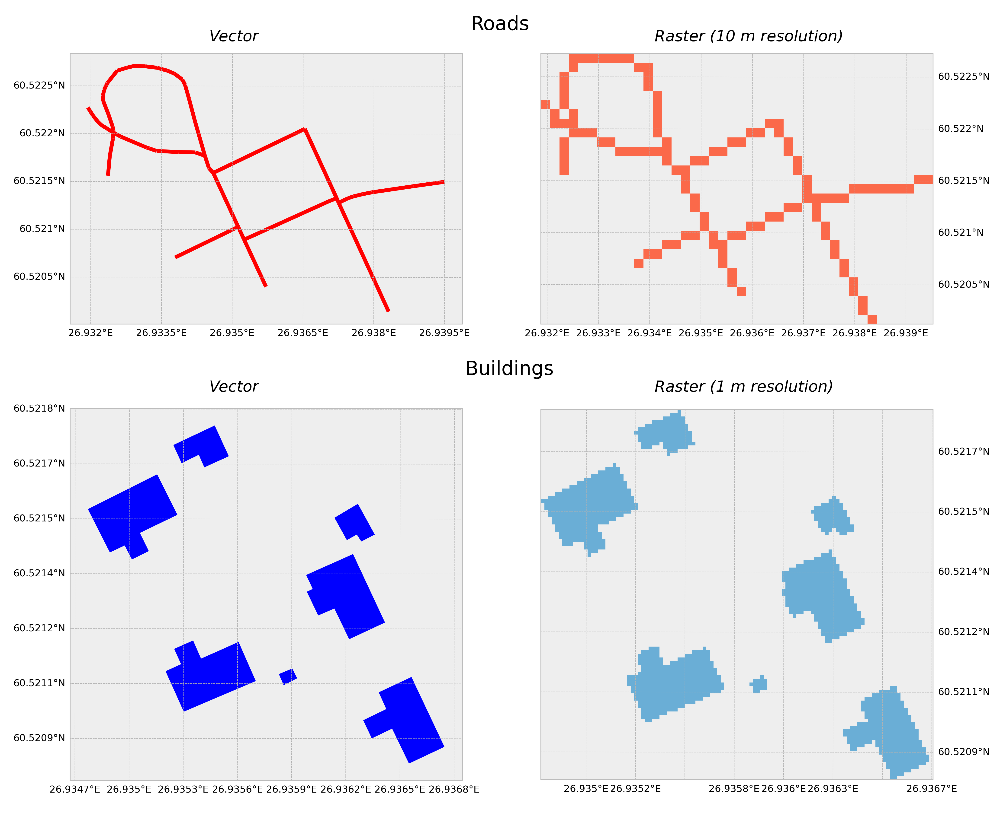
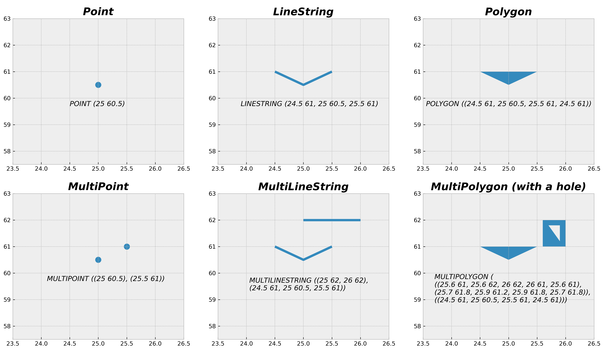
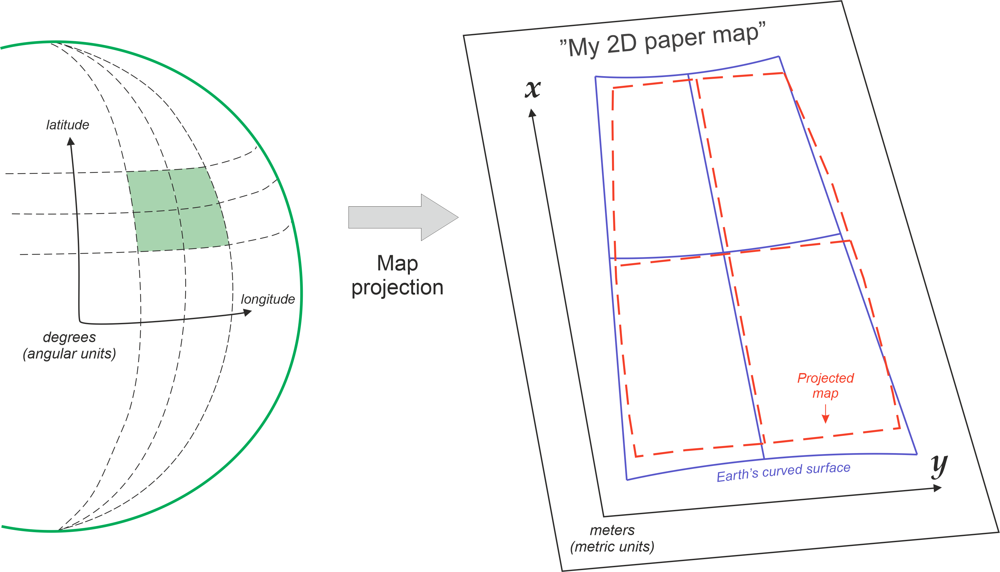

## Visão geral

Esta aula será dividida em três partes:

::: {.incremental}
1. Conceitos básicos de Python
2. Introdução à análise de dados com Python
3. Introdução aos dados geográficos com Python
4. Manipulação de dados geográficos com Python
:::

# Conceitos básicos de Python

## Por que usar programação para análise de dados geográficos?

::: {.incremental}
- Automatização de tarefas repetitivas
- Manipulação de grandes volumes de dados
- Reprodutibilidade dos resultados
- Preservação do histórico de operações
:::

## Por que usar Python para análise de dados geográficos?

::: {.incremental}
- Gratuito e de código aberto
- Python é amigável para iniciantes
- Ampla utilização no ecossistema de análise de dados
- Grande interface com ferramentas e bibliotecas de análise de dados geográficos
:::

## Variáveis e tipos de dados

```{python}
#| echo: true
# Exemplo de variáveis e tipos de dados em Python
nome = "João"  # String
idade = 30  # Inteiro
altura = 1.75  # Float
peso = 70.5  # Float
ativo = True  # Booleano
```

## Variáveis e tipos de dados

```{python}
#| echo: true

imc = peso / (altura * altura)  # Cálculo do Índice de Massa Corporal
print(f"O IMC de {nome} é: {imc:.2f}")
```

## Listas

```{python}
#| echo: true
distritos_sp = [
    "Sé",
    "Itaquera",
    "Jaçanã",
    "Moema",
    "Vila Mariana",
]
print(distritos_sp)
```

## Listas - Acessando elementos

```{python}
#| echo: true
print(distritos_sp[0])  # Primeiro elemento
print(distritos_sp[-1])  # Último elemento
```

## Listas - Operações básicas: adicionar
```{python}
#| echo: true
distritos_sp.append("Butantã")  # Adiciona um novo elemento à lista
print(distritos_sp)
```

## Listas - Operações básicas: invertendo a ordem

```{python}
#| echo: true
distritos_sp.reverse() # Inverte a ordem dos elementos na lista
print(distritos_sp)
```

## Listas - Operações básicas: ordenando os elementos
```{python}
#| echo: true
distritos_sp.sort() # Ordena os elementos da lista em ordem alfabética
print(distritos_sp)
```

## Laços - for

```{python}
#| echo: true
# Exemplo ruim
print(distritos_sp[0])
print(distritos_sp[1])
print(distritos_sp[2])
print(distritos_sp[3])
print(distritos_sp[4])
print(distritos_sp[5])
```

## Laços - for

```{.python}
# Exemplo pior
print(distritos_sp[6])
```
```
---------------------------------------------------------------------------
IndexError                                Traceback (most recent call last)
Cell In[35], line 2
      1 # Exemplo pior
----> 2 print(distritos_sp[6])

IndexError: list index out of range
```

## Laços - for
```{python}
#| echo: true
# Exemplo bom
for distrito in distritos_sp:
    print(distrito)
```

## Declaração Condicional - if

```{python}
#| echo: true
# Exemplo de declaração condicional
if idade < 18:
    print("Menor de idade")
else:
    print("Maior de idade")
```

## Declaração Condicional - if

```{python}
#| echo: true
# Exemplo de declaração condicional
if idade < 18:
    print("Menor de idade")
elif idade < 65:
    print("Adulto")
else:
    print("Idoso")
```

## Declaração Condicional - if

```{python}
#| echo: true

print(distritos_sp)

for distrito in distritos_sp:
    if "u" in distrito:
        print(f"{distrito} é um distrito que possui a letra 'u'.")
```

## Funções


```{python}
#| echo: true
# Exemplo de função
def calcular_imc(peso, altura):
    imc = peso / (altura * altura)
    return imc

nome_maria = "Maria"
peso_maria = 60.0
altura_maria = 1.65
imc_maria = calcular_imc(peso_maria, altura_maria)
print(f"O IMC de {nome_maria} é: {imc_maria:.2f}")
```

# Análise de dados com Python

## Tabelas

[Wikipedia](https://pt.wikipedia.org/wiki/Lista_dos_distritos_de_S%C3%A3o_Paulo_por_popula%C3%A7%C3%A3o){preview-link="true"}

## Abrindo tabelas com Python

```{python}
#| echo: true
#| code-line-numbers: "|4|7|9|10|"
import pandas as pd

# Lendo a tabela diretamente da Wikipedia
url = "https://pt.wikipedia.org/wiki/Lista_dos_distritos_de_S%C3%A3o_Paulo_por_popula%C3%A7%C3%A3o"

# Configuração de headers para evitar bloqueio por parte do servidor
headers = {"User-Agent": "Chrome/120.0.0.0"}

tabela = pd.read_html(url, header=0, storage_options=headers)[1]
tabela.head(2)  # Exibe as primeiras linhas da tabela
```

## Selecionando linhas

```{python}
#| echo: true
# Selecionando pelo índice
tabela.loc[1]
```

## Selecionando linhas

```{python}
#| echo: true
# Selecionando pela posição
tabela.iloc[1]
```

## Selecionando linhas

```{python}
#| echo: true
# Selecionando pela posição
tabela.iloc[-1]
```

## Selecionando linhas

```{python}
#| echo: true
#| code-line-numbers: "4|"
# Ordena a tabela pelo nome do distrito
tabela.sort_values("Distrito", inplace=True)
tabela.head(4)
```

## Selecionando linhas

```{python}
#| echo: true
# Selecionando pelo índice
tabela.loc[3]
```

## Selecionando linhas

```{python}
#| echo: true
# Selecionando pela posição
tabela.iloc[3]
```

## Selecionando colunas

```{python}
#| echo: true
#| code-line-numbers: "4|"

# Selecionando a coluna de população total
tabela["Pop. Total 2022"].head(4)
```

## Selecionando colunas

```{python}
#| echo: true
# Selecionando a coluna de população total e urbana
colunas = ["Pop. Total 2022", "Pop. Urb. 2022"]
tabela[colunas].head(4)
```

## Calculando estatísticas básicas

```{python}
#| echo: true
# Calculando a média da população total
media_pop_total = tabela["Pop. Total 2022"].mean()
print(f"A média da população total dos distritos é: {media_pop_total:.0f}")
```

## Calculando estatísticas básicas

```{python}
#| echo: true
# Calculando a soma da população total e urbana
colunas = ["Pop. Total 2022", "Pop. Urb. 2022"]
tabela[colunas].sum()
```

## Filtrando dados

```{python}
#| echo: true
# Filtrando os distritos com população total maior que 100.000
filtro = tabela["Pop. Total 2022"] > 100000
tabela[filtro].head(4)
```

## Filtrando dados

```{python}
#| echo: true
# Filtrando os distritos com população total diferente da população urbana
filtro = tabela["Pop. Total 2022"] != tabela["Pop. Urb. 2022"]
tabela[filtro].head(4)
```

## Criando novas colunas

```{python}
#| echo: true
# Criando uma nova coluna de População Rural
tabela["Pop. Rural 2022"] = tabela["Pop. Total 2022"] - tabela["Pop. Urb. 2022"]
tabela.head(4)
```

## Criando novas colunas

```{python}
#| echo: true
tabela.sort_values("Pop. Rural 2022", ascending=False).head(4)
```

## Criando novas colunas

```{python}
#| echo: true
# Criando uma nova coluna de percentual de população rural
tabela["% Pop. Rural 2022"] = 100 * tabela["Pop. Rural 2022"] / tabela["Pop. Total 2022"]
tabela.sort_values("% Pop. Rural 2022", ascending=False).head(4)
```

## Renomeando colunas

```{python}
#| echo: true
tabela.rename(columns={"Unnamed: 0": "Posto"}, inplace=True)
tabela.head(4)
```

## Renomeando colunas

```{python}
#| echo: true
# Criando coluna para os 10 distritos mais populosos
tabela["Posto_numerico"] = tabela["Posto"].str.rstrip(".º").astype(int)
tabela.sort_values("Posto_numerico", inplace=True)
tabela.head(4)
```

## Renomeando colunas

```{python}
#| echo: true
# Criando coluna para os 10 distritos mais populosos
tabela["Dez mais populosos"] = tabela["Posto_numerico"] <= 10
tabela.head(4)
```

## Agrupando e agregando dados

```{python}
#| echo: true
# Agrupando por dez mais populosos e calculando a soma da população total
tabela.groupby("Dez mais populosos")[["Pop. Total 2022"]].sum()
```

## Agrupando e agregando dados

```{python}
#| echo: true
# Agrupando por dez mais populosos e calculando a soma da população total
pop_total = tabela["Pop. Total 2022"].sum()
tabela.groupby("Dez mais populosos")[["Pop. Total 2022"]].sum()/pop_total*100
```

## Juntando tabelas

```{python}
#| echo: true
# Carregando dados de escolas
url_escolas = "https://dados.prefeitura.sp.gov.br/dataset/8da55b0e-b385-4b54-9296-d0000014ddd5/resource/a12ad63d-d944-4e35-9aac-71a5ae0b7bdf/download/escolas122022.csv"
escolas = pd.read_csv(url_escolas, sep=";", encoding="latin1")
escolas.head(4)
```

## Juntando tabelas

```{python}
#| echo: true
escolas[['DISTRITO']].head(4)
```

## Juntando tabelas

```{python}
#| echo: true
escolas_agrupadas = escolas.groupby("DISTRITO").size()
escolas_agrupadas.head(4)
```

## Juntando tabelas

```{python}
#| echo: true
escolas_distrito = escolas_agrupadas.reset_index(name="Número de Escolas")
escolas_distrito.head(4)
```


## Juntando tabelas

```{python}
#| echo: true

# Normalizando os nomes dos distritos para a junção
tabela['DISTRITO'] = tabela['Distrito'].str.upper()
tabela.head(4)
```


## Juntando tabelas

```{python}
#| echo: true
from unidecode import unidecode

# Normalizando os nomes dos distritos para a junção
tabela['DISTRITO'] = tabela['DISTRITO'].apply(unidecode)
tabela.head(4)
```

## Juntando tabelas

```{python}
#| echo: true
# Juntando as tabelas de população e escolas pelo nome do distrito
tabela_juntada = tabela.merge(escolas_distrito, on="DISTRITO", how="left")
tabela_juntada.head(4)
```

# Dados geográficos com Python

## Tipos de representação de dados geográficos

{fig-align="center"}

## Tipos de geometrias

{fig-align="center"}

## Formatos de arquivos de dados geográficos

::: {.incremental}
- **Shapefile**: Formato popular para dados vetoriais, suportado por muitos sistemas de informação geográfica (SIG). Possui uma estrutura de arquivos múltiplos (.shp, .shx, .dbf) que armazenam diferentes aspectos dos dados e algumas limitações associadas à época de desenvolvimento do formato.
- **GeoJSON**: Formato aberto baseado em JSON para representar dados geográficos, amplamente utilizado em aplicações web. Porém, por ser baseado em texto, pode ser menos eficiente para grandes volumes de dados em comparação com formatos binários.
- **GeoPackage (GPKG)**: Formato aberto de arquivo de banco de dados SQLite para dados geoespaciais, suportando tanto dados vetoriais quanto raster, além de suportar várias camadas em um único arquivo.
- **GeoParquet**: Formato de arquivo baseado em Parquet para dados geoespaciais, projetado para ser eficiente em termos de armazenamento e desempenho, especialmente para grandes volumes de dados. Ele é otimizado para leitura e escrita rápida de todos os registros, tornando-o adequado para análise de dados geográficos em larga escala.
- **KML**: Menos utilizado do que os outros formatos no mundo do python, é um formato XML usado para representar dados geográficos em aplicativos como Google Earth.
:::

## Sistemas de referência de coordenadas (CRS)

Possui tipicamente três componentes principais:

::: {.incremental}
1. **Datum**: Referência geodésica que relaciona o sistema de coordenadas com a superfície da Terra. É o que define o tamanho e a forma da Terra, como uma esfera, um elipsóide ou um geoide. Além disso, o datum define a posição do sistema de coordenadas em relação à Terra.
2. **Projeção**: Método utilizado para representar a superfície curva da Terra em um plano. Existem várias projeções, cada uma com suas próprias distorções e usos específicos.
3. **Parâmetros adicionais**: Informações que podem ser usadas para ajustar a representação dos dados geográficos, como a escala e o meridiano central.
:::

**Observação**: existem sistemas de referência de coordenadas sem projeção, chamados de sistemas de coordenadas geográficas, que utilizam latitude e longitude para representar a localização na superfície da Terra.

## Projeção de dados geográficos

{fig-align="center"}

Porém, diversas operações de análise de dados geográficos exigem que os dados estejam em um sistema de referência de coordenadas projetado e, em caso de múltiplas tabelas de dados geográficos, é necessário que todas estejam no mesmo sistema de referência de coordenadas.

## Representação de dados geográficos em Python - Pontos

```{python}
#| echo: true
from shapely.geometry import Point

# Criando um ponto
ponto = Point(10, 20)
ponto
```

## Representação de dados geográficos em Python - Linhas

```{python}
#| echo: true
from shapely.geometry import LineString

# Criando uma linha
linha = LineString([(0, 0), (1, 1), (1, 2)])
linha
```

## Representação de dados geográficos em Python - Polígonos

```{python}
#| echo: true
from shapely.geometry import Polygon

# Criando um polígono
poligono = Polygon([(0, 0), (2, 0), (2, 1), (4, 0), (3, 2), (1, 1), (0, 2)])
poligono
```

## Representação de dados geográficos em Python - Geometrias complexas

```{python}
#| echo: true
from shapely.geometry import MultiPoint

lista_de_pontos = [Point(0, 0),
                   Point(1, 2),
                   Point(2, 1)]

# Criando uma coleção de pontos
pontos = MultiPoint(lista_de_pontos)
pontos
```

## Tabelas de dados geográficos em Python - GeoDataFrames

```{python}
#| echo: true
import geopandas as gpd

# url_geojson = "https://wfs.geosampa.prefeitura.sp.gov.br/geoserver/ows?service=WFS&version=2.0.0&request=GetFeature&typeNames=geoportal:ponto_onibus&outputFormat=application/json"
url_geojson = "https://wfs.geosampa.prefeitura.sp.gov.br/geoserver/ows?service=WFS&version=2.0.0&request=GetFeature&typeNames=geoportal:area_risco_geologico&outputFormat=application/json"

# O GeoPandas consegue ler a URL WFS diretamente
areas_risco = gpd.read_file(url_geojson)

# Exibe as primeiras linhas da tabela com a geometria
areas_risco.head()
```

##

## Calculando estatísticas básicas com dados geográficos

```{python}
# | echo: true

# Calculando o número de áreas de risco geológico
num_areas_risco = areas_risco["geometry"].count()
print(f"O número de áreas de risco geológico é: {num_areas_risco}")

# Calculando a média de moradias em áreas de risco geológico
media_moradias = areas_risco["qt_moradia"].mean()
print(f"A média de moradias em áreas de risco geológico é: {media_moradias:.0f}")
```

## Agrupando e agregando dados geográficos

```{python}
#| echo: true
# Agrupando por grau de risco e calculando a soma de moradias
areas_risco.groupby("tx_grau_de_risco_geologico")[["qt_moradia"]].sum()
```

## Filtrando e agregando dados geográficos

```{python}
#| echo: true

# Filtrando apenas as áreas de escorregamento
filtro = areas_risco["tx_tipo_processo_geologico"] == "ESCORREGAMENTO"
areas_escorregamento = areas_risco[filtro]

areas_escorregamento.groupby("tx_grau_de_risco_geologico")[["qt_moradia"]].sum()
```

## Juntando tabelas de dados geográficos

```{python}
#| echo: true

url_geojson = "https://wfs.geosampa.prefeitura.sp.gov.br/geoserver/ows?service=WFS&version=2.0.0&request=GetFeature&typeNames=geoportal:ponto_onibus&outputFormat=application/json"

# O GeoPandas consegue ler a URL WFS diretamente
pontos_onibus = gpd.read_file(url_geojson)

# Exibe as primeiras linhas da tabela com a geometria
pontos_onibus.head()
```

## Juntando tabelas de dados geográficos

```{python}
#| echo: true
pontos_onibus.plot()
```

## Juntando tabelas de dados geográficos

```{python}
#| echo: true
# Carregando dados de distritos
url_distritos = "https://wfs.geosampa.prefeitura.sp.gov.br/geoserver/ows?service=WFS&version=2.0.0&request=GetFeature&typeNames=geoportal:distrito_municipal&outputFormat=application/json"
distritos = gpd.read_file(url_distritos)
distritos.head(4)
```


```{python}
#| echo: true
distritos.plot(edgecolor="cornflowerblue")
```

## Juntando tabelas de dados geográficos

```{python}
#| echo: true
# Conferindo os sistemas de coordenadas
print(f"Sistema de coordenadas dos pontos de ônibus: {pontos_onibus.crs}")
print(f"Sistema de coordenadas dos distritos: {distritos.crs}")
```
[SIRGAS 2000 / UTM zone 23S - EPSG:31983](https://epsg.io/31983){preview-link="true"}

## Juntando tabelas de dados geográficos

```{python}
#| echo: true
# Selecionando apenas algumas colunas dos distritos para a junção
colunas_selecionadas = ["nm_distrito_municipal", "geometry"]

# Juntando os pontos de ônibus com os distritos
pontos_onibus_distritos = pontos_onibus.sjoin(distritos[colunas_selecionadas], how="left", predicate="within")
pontos_onibus_distritos.head(4)
```

## Juntando tabelas de dados geográficos

```{python}
#| echo: true
# Contando o número de pontos de ônibus por distrito
pontos_por_distrito = pontos_onibus_distritos\
                      .groupby("nm_distrito_municipal")\
                      .size()\
                      .reset_index(name="Número de Pontos de Ônibus")
pontos_por_distrito.head(4)
```

## Juntando tabelas

```{python}
#| echo: true
# Juntando a tabela de pontos de ônibus por distrito com a tabela inicial

pontos_por_distrito.rename(columns={"nm_distrito_municipal": "DISTRITO"},
                           inplace=True)

tabela_distritos = tabela.merge(pontos_por_distrito)
tabela_distritos.head(4)
```

## Juntando tabelas

```{python}
#| echo: true
# calculando o número de pontos de ônibus por 100.000 habitantes
tabela_distritos["Pontos de Ônibus por 100.000 habitantes"] = 100000 * tabela_distritos["Número de Pontos de Ônibus"] / tabela_distritos["Pop. Total 2022"]
tabela_distritos.head(4)
```

# BÔNUS: Visualização de dados geográficos com Python

## Voltando os dados de pontos de ônibus para o formato geográfico

```{python}
#| echo: true

distritos.rename(columns={"nm_distrito_municipal": "DISTRITO"},
                 inplace=True)

distritos_com_pontos = distritos.merge(tabela_distritos[["Pontos de Ônibus por 100.000 habitantes", "DISTRITO"]])

distritos_com_pontos.head(4)
```

```{python}
import matplotlib.pyplot as plt

# Definindo o tamanho da figura
plt.figure(figsize=(10, 10))

# Plotando a tabela de distritos
distritos_com_pontos.plot(column="Pontos de Ônibus por 100.000 habitantes",
                          cmap="OrRd",
                          legend=True,
                          legend_kwds={"loc": "upper right",
                                       "title": "Pontos de Ônibus por 100.000 habitantes",
                                       "bbox_to_anchor": (2.5, 1)},
                          scheme="quantiles")

# Adicionando título
plt.title("Número de Pontos de Ônibus por 100.000 habitantes por Distrito em São Paulo", fontsize=16)

# Exibindo o gráfico
plt.show()
```